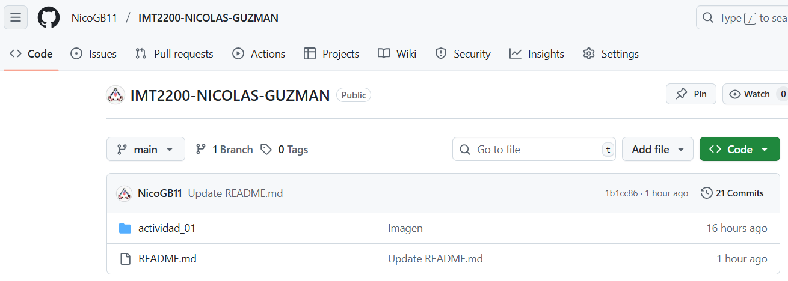
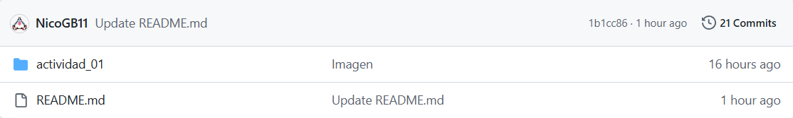
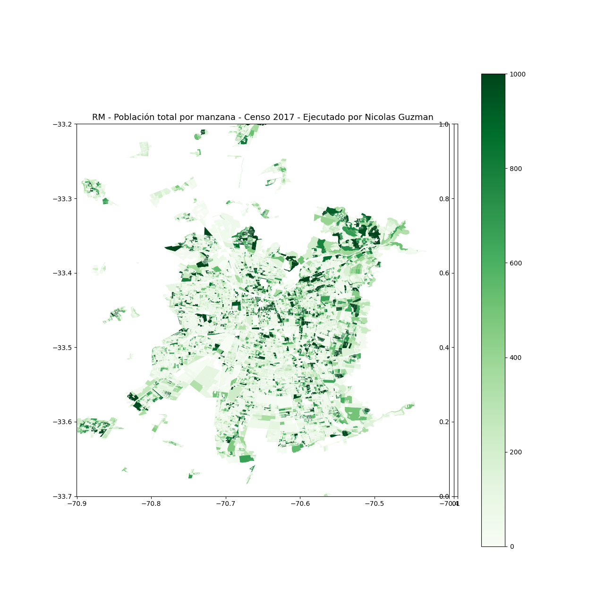

# imt2200_actividad1
## Actividad 01 de Introduccion a Ciencia de Datos
- Aqui encontraran el desarrollo de la primera actividad del curso
### Objetivos:
- Crear un repositorio en su cuenta personal con el nombre IMT2200-- y clonar en su computador.
  

- Crear una carpeta adentro llamada "Actividad 01" y copiar adentro el contenido de la carpeta "Actividad 01" del repositorio del curso.
  

- Actualizar el repositorio agregando el Notebook de Jupyter y la imagen con el Mapa con su nombre.
  

##### MAPA GENERADO PARA LA ACTIVIDAD:

- Editar el archivo **README.md** para describir su repositorio. **(Aca mismo puedes ver que esta editado)**
- Entregar en el módulo Actividad 1 en Canvas la URL de su repositorio para corrección.

