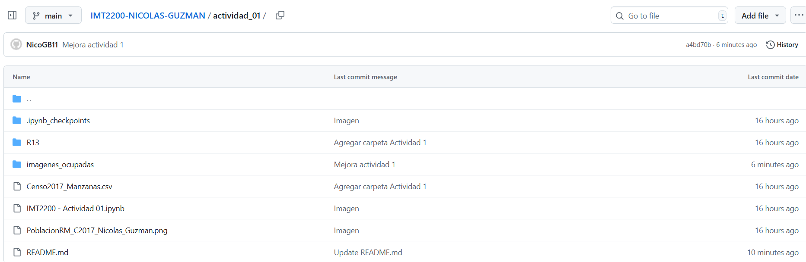
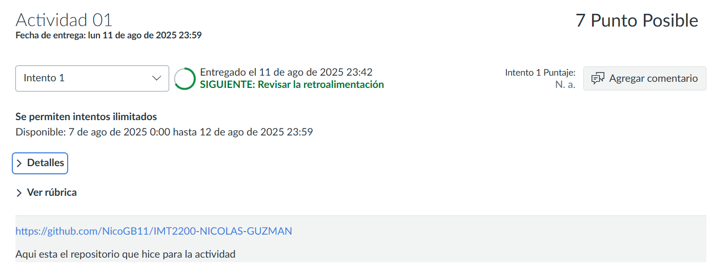

# imt2200_actividad1
# ⚙️ Actividad 01 de Introduccion a Ciencia de Datos
- Aqui encontraran el desarrollo de la primera actividad del curso
# 🎯 Objetivos:
- ✅ Crear un repositorio en su cuenta personal con el nombre IMT2200-- y clonar en su computador.
  

- ✅ Crear una carpeta adentro llamada "Actividad 01" y copiar adentro el contenido de la carpeta "Actividad 01" del repositorio del curso.
  

- ✅ Actualizar el repositorio agregando el Notebook de Jupyter y la imagen con el Mapa con su nombre.
  

# 🗺️ MAPA GENERADO PARA LA ACTIVIDAD:

- ✅ Editar el archivo **README.md** para describir su repositorio. **(Aca mismo puedes ver que esta editado)**
- ✅ Entregar en el módulo Actividad 1 en Canvas la URL de su repositorio para corrección.

# ✨✨✨¡¡¡Con esto damos por terminado la actividad!!!✨✨✨
